## Downloading the Data

Before running the code, download the data from the [Google Drive link](https://drive.google.com/drive/folders/1eP7FtPaWfJ5zLdcsZYl6eyn5EYixkFn8) and place it in the `data` directory, which should be located at the root of the project directory

## Running the Code

To train the model, simply execute the training script:

```bash
python BoxHead.py
```
For evaluation, refer to the provided Jupyter Notebook `rcnn.ipynb`

## Image plots of the proposals with the no-background classes and their ground truth boxes
### The thick solid boxes represent the ground truth, while the thin dashed boxes are the proposals
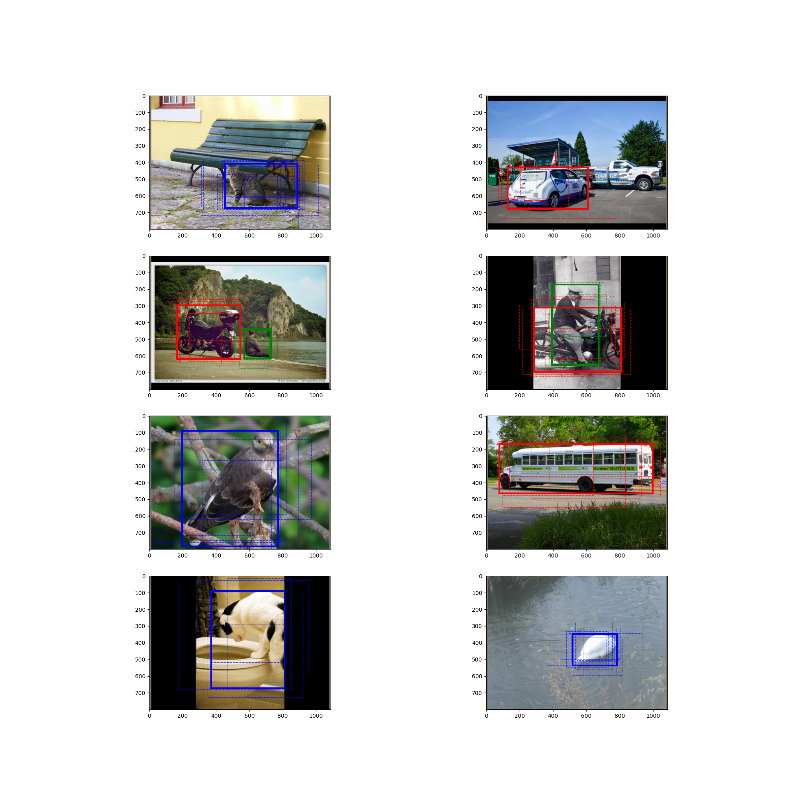
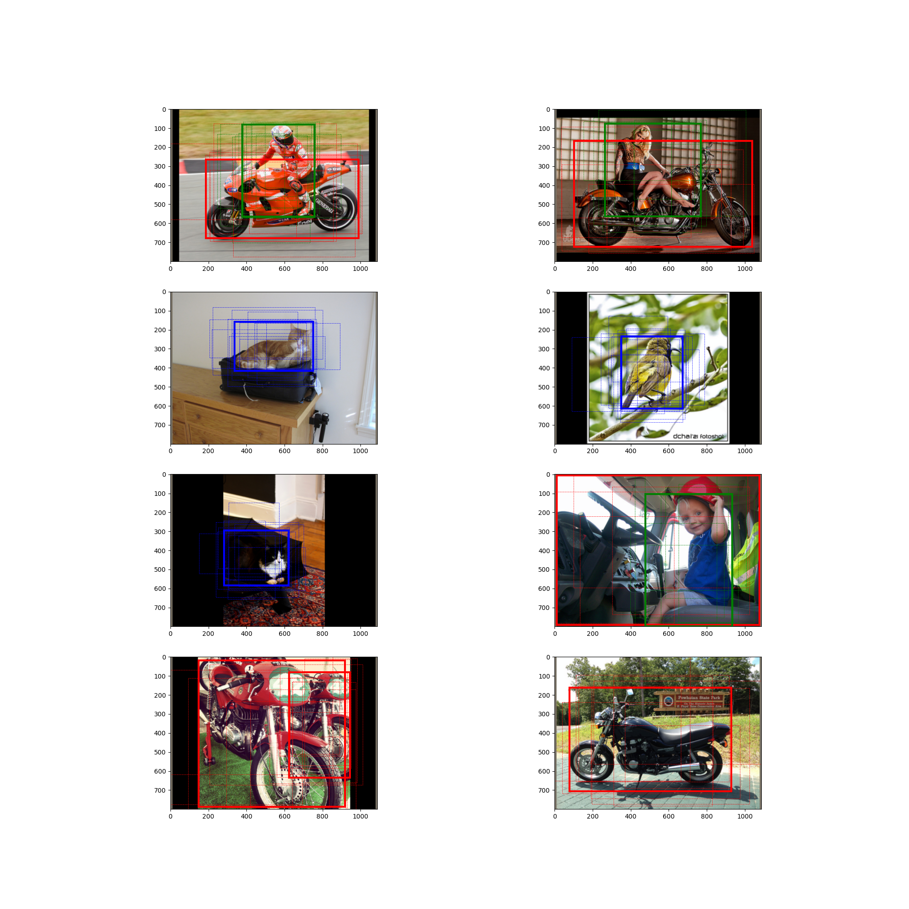


## Training and Validation curves of the total loss, the loss of the classifier, and the loss of the regressor of the Box Head
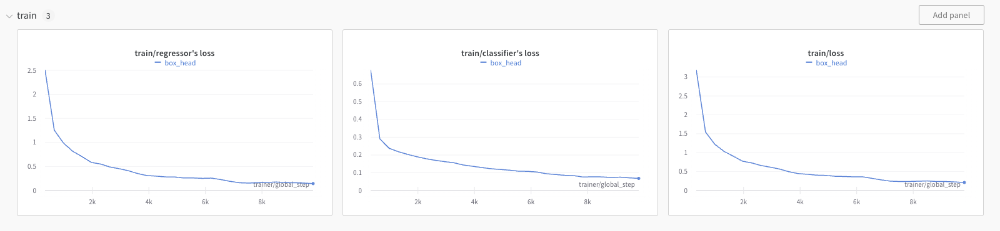
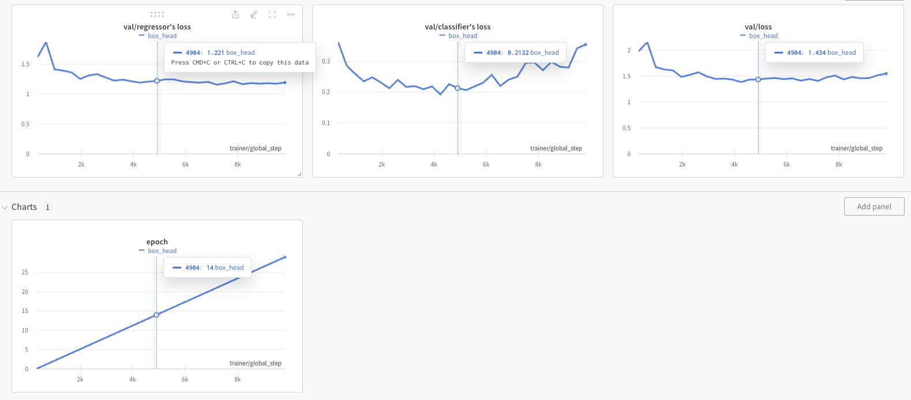

Please note that the plots start from epoch 0, so when referring to 'epoch 14' on the plot, it actually corresponds to epoch 15 in the training process

## AP and mAP Scores of the Test Set
During the training process, we saved model checkpoints at epoch 15 and at the end of training, which is epoch 30. We obtained the following Average Precision (AP) values for the test set using these two models:

**Epoch 15:**
- The Average Precision for the 'Vehicles' class is: 0.923
- The Average Precision for the 'People' class is: 0.970
- The Average Precision for the 'Animals' class is: 0.937
- The mAP is 0.943

**Epoch 30:**
- The Average Precision for the 'Vehicles' class is: 0.931
- The Average Precision for the 'People' class is: 0.969
- The Average Precision for the 'Animals' class is: 0.936
- The mAP is 0.945

## Image plots that contain the top 20 boxes produced by the Box Head before NMS
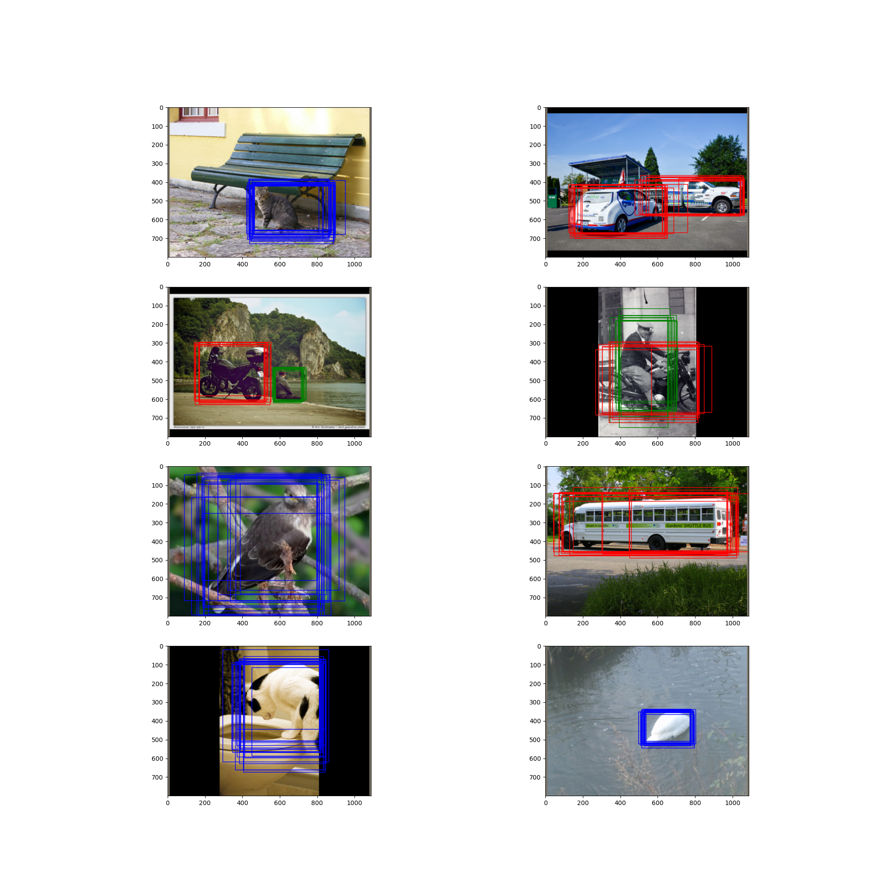

## Image plots of the regressed boxes after the postprocessing

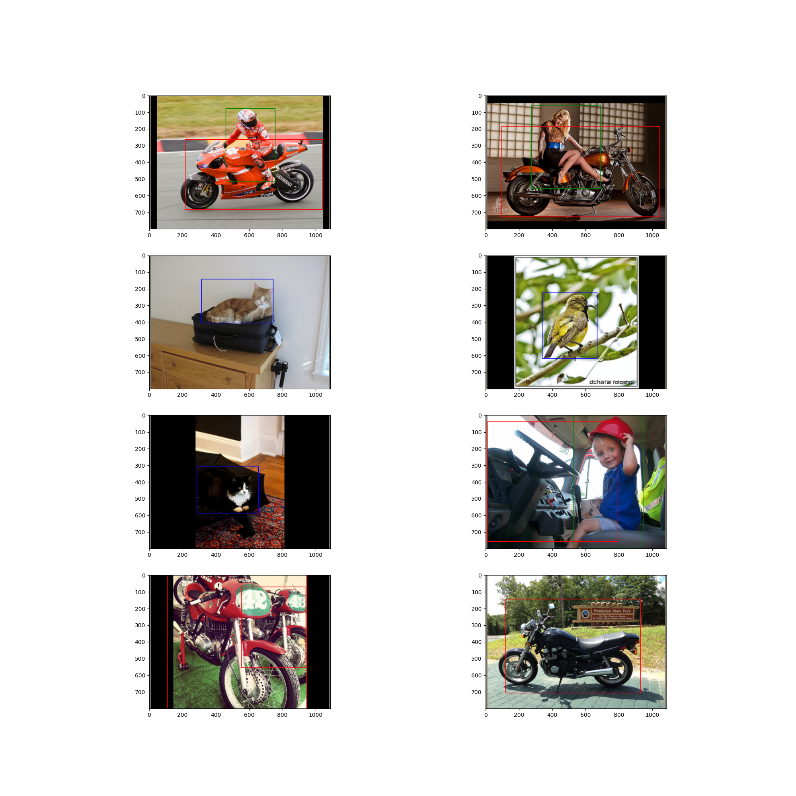


## Analyzing mAP for a Single Batch of Data
This section provides an analysis of the mean Average Precision (mAP) for a single batch of data. The plot below illustrates the ground truth boxes in blue and the predicted boxes in red for the batch of images, offering insights into the model's performance on this specific subset of data.
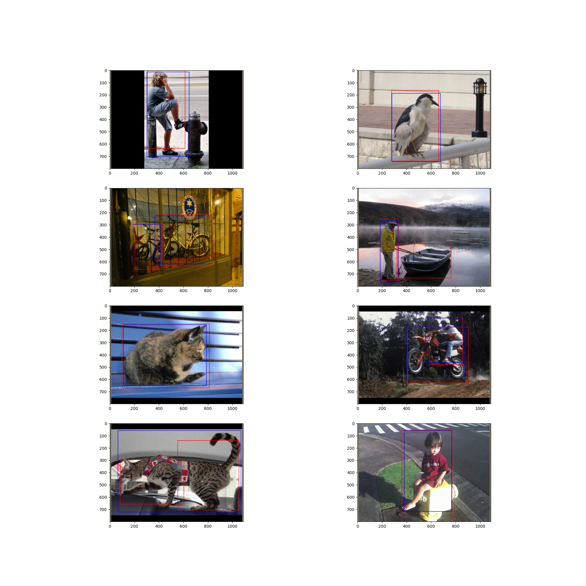

The mAP of this batch of data is 0.852. Below, we present the precision-recall (PR) curves for each class, along with a detailed precision-recall table for the Vehicle Class

### Precision-Recall Table for Vehicle Class
| Image   | Confidence | TP or FP | Precision | Recall |
|---------|------------|----------|-----------|--------|
| Image 6 | 0.99989796 | TP       | 1/1       | 1/3    |
| Image 3 | 0.99973518 | TP       | 2/2       | 2/3    |
| Image 3 | 0.99083507 | TP       | 3/3       | 3/3    |
| Image 3 | 0.99032766 | FP       | 3/4       | 3/3    |
| Image 4 | 0.98912036 | FP       | 3/5       | 3/3    |

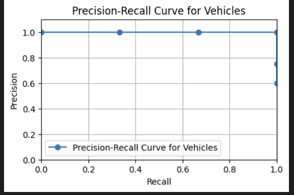

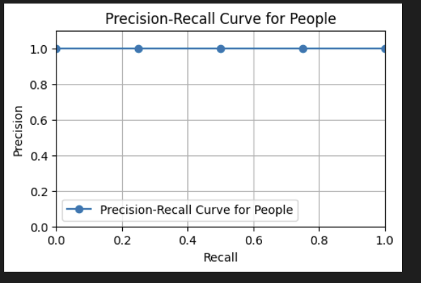

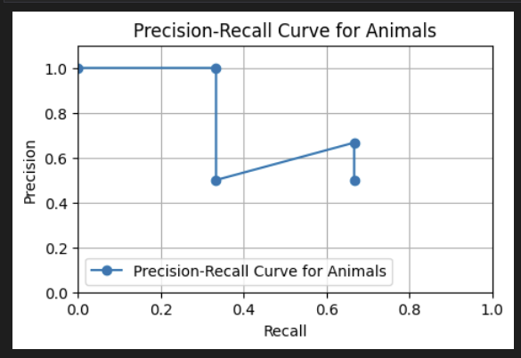

Note: The 'wiggles' in the precision-recall curve have been smoothed using interpolated precision, represented by the orange line, for the calculation of mAP, as illustrated in the figure below:
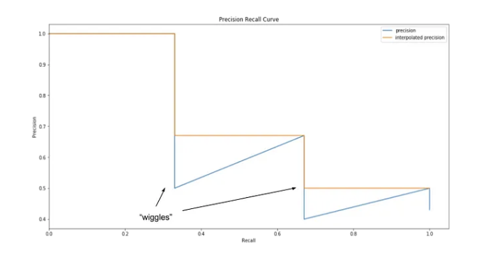

## Implementation Specifics

- The threshold for NMS is set to 0.4, instead of the commonly used 0.5
- The optimizer is Adam optimizer with a learning rate of 0.0001
- A step learning rate scheduler reduces the learning rate by 10% every 10 epochs
- The effective batch size for training is set to 100, indicating the number of samples per mini-batch
